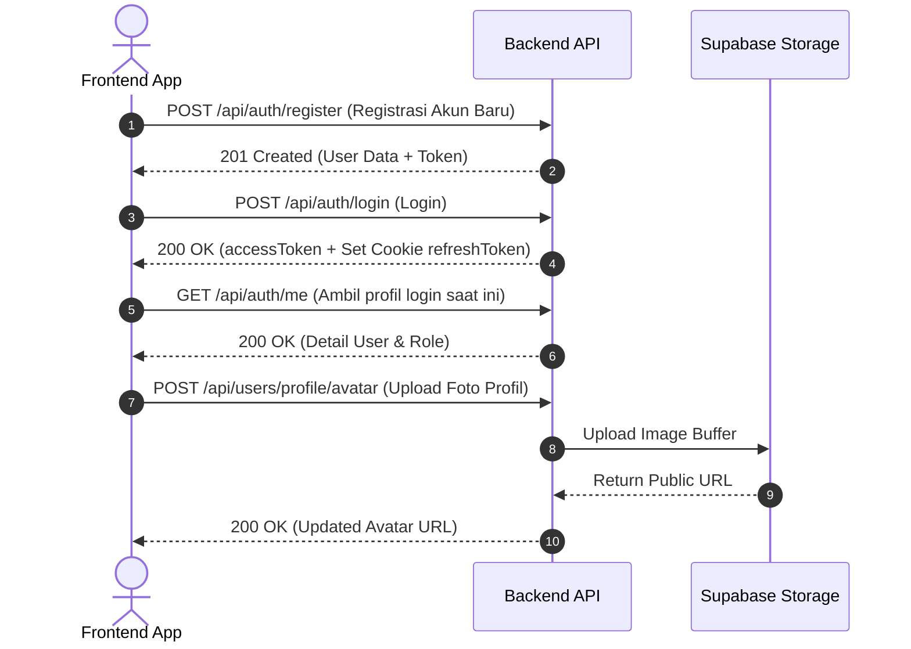
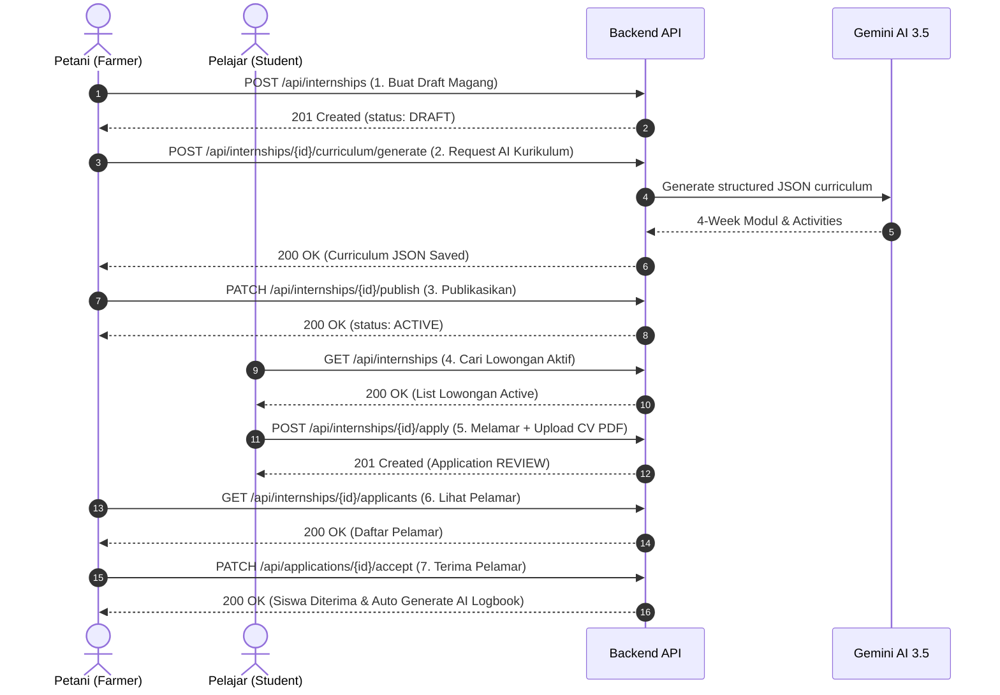
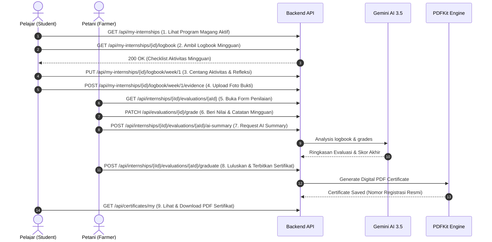
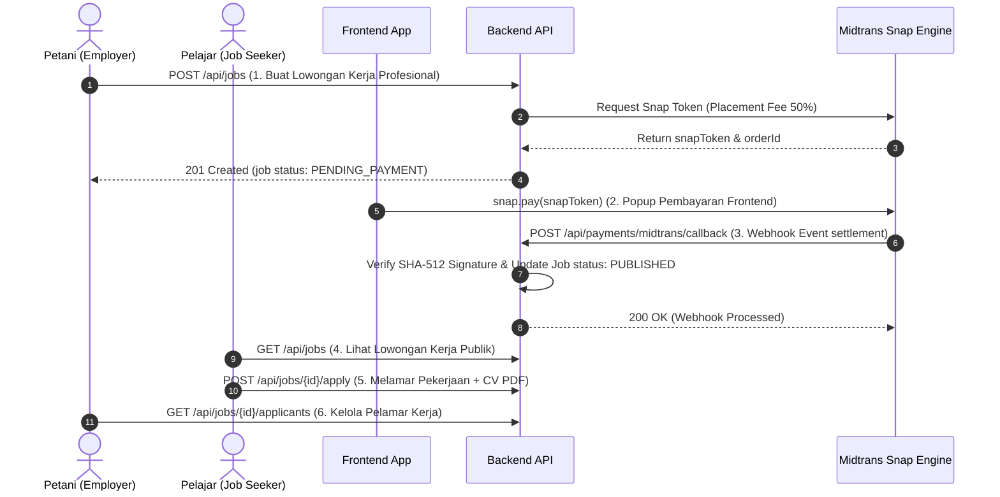

# 🗺️ Alur Penggunaan API Jadipetani (API Flow Guide for Frontend)

Dokumen ini disusun khusus sebagai panduan integrasi bagi **Frontend Developer (FE)** untuk memahami urutan pemanggilan endpoint (*API Workflow*), parameter, headers, dan struktur respon pada aplikasi **Jadipetani**.

---

## 📍 Environment & Base URL

- **Production Server (Railway)**: `https://be-jadipetani-production.up.railway.app`
- **Development Server (Lokal)**: `http://localhost:5000`
- **Interactive Scalar Documentation**: `https://be-jadipetani-production.up.railway.app/docs`

---

## 🔐 Standar Otentikasi & Authorization Headers

Hampir seluruh endpoint (kecuali publik) membutuhkan otentikasi berbasis **JWT Access Token**.

### 1. Header yang Wajib Dikirim:
```http
Authorization: Bearer <accessToken>
Content-Type: application/json
```

*(Khusus endpoint unggah file seperti CV PDF & Foto Avatar/Logbook, gunakan `Content-Type: multipart/form-data`)*.

### 2. Manajemen Token JWT:
- **`accessToken`**: Berlaku selama **1 jam**. Dikirimkan via header `Authorization: Bearer <token>`.
- **`refreshToken`**: Berlaku selama **7 hari**. Disimpan otomatis oleh browser dalam `HTTP-Only Cookie` bernama `refreshToken`.
- **Pembaruan Token Otomatis**: Jika request melempar respon `401 Unauthorized` dengan pesan `"Token sudah kedaluwarsa"`, Frontend memanggil `POST /api/auth/refresh` (tanpa body, cookie otomatis terikut `credentials: 'include'`) untuk mendapatkan `accessToken` baru.

---

## 👥 Matriks Hak Akses Peran (Role Matrix)

| Peran (Role) | Keterangan & Hak Akses |
|---|---|
| **GUEST (Publik)** | Tanpa login. Akses landing stats, pencarian & detail magang/job publik. |
| **STUDENT (Pelajar/Mahasiswa)** | Melamar magang/job, mengelola profil & avatar, mengisi logbook mingguan, upload bukti foto, klaim & unduh sertifikat PDF, bookmark. |
| **FARMER (Petani/Mentor)** | Membuat & mengedit lowongan magang, generate kurikulum AI, seleksi pelamar, penilaian logbook, generate ringkasan evaluasi AI, meluluskan & terbit sertifikat PDF, pasang lowongan kerja (Midtrans). |

---

## 🔄 Flow 1: Otentikasi & Profil Pengguna



### Langkah Integrasi FE:
1. **Registrasi Pengguna**: `POST /api/auth/register`
   - **Body**: `{ "fullName": "...", "email": "...", "password": "...", "confirmPassword": "...", "role": "STUDENT" | "FARMER", "agreedToTerms": true }`
2. **Login Pengguna**: `POST /api/auth/login`
   - **Body**: `{ "email": "...", "password": "..." }`
   - **Respon**: Mengembalikan `accessToken` & `user`. Simpan `accessToken` di State/LocalStorage FE.
3. **Ambil Data User Login**: `GET /api/auth/me`
   - **Header**: `Authorization: Bearer <accessToken>`
4. **Update Profil**: `PUT /api/users/profile`
   - **Body**: `{ "fullName": "...", "phone": "...", "address": "...", "institution": "...", "bio": "..." }`
5. **Upload Foto Avatar**: `POST /api/users/profile/avatar`
   - **Header**: `Content-Type: multipart/form-data`
   - **FormData Field**: `avatar` (File Image `.jpg`, `.jpeg`, `.png`, max 5MB)
6. **Ubah Password**: `PUT /api/users/change-password`
   - **Body**: `{ "currentPassword": "...", "newPassword": "...", "confirmNewPassword": "..." }`
7. **Cek Kelengkapan Profil**: `GET /api/users/profile/completion`
   - **Respon**: `{ "completionPercentage": 83, "isComplete": false }`
8. **Logout**: `POST /api/auth/logout`
   - Hapus `accessToken` di FE State. Server menghapus HTTP-Only `refreshToken` cookie.

---

## 🌾 Flow 2: Siklus Program Magang (Internship Flow)



### Langkah Integrasi FE:

#### 🟢 Sisi Petani (Farmer):
1. **Buat Draft Magang**: `POST /api/internships`
   - **Body**:
     ```json
     {
       "title": "Magang Hidroponik Melon Super",
       "commodity": "Melon Hibrida Super",
       "location": "Lembang, Bandung Barat",
       "durationMonths": 1,
       "quota": 5,
       "deadline": "2026-10-01T00:00:00.000Z",
       "facilities": "Mes, makan siang, alat kerja",
       "description": "Program magang 1 bulan nutrisi AB Mix & drip fertigation."
     }
     ```
   - **Respon**: Mengembalikan `id` lowongan magang (`status: DRAFT`).

2. **Generate Kurikulum Otomatis via AI**: `POST /api/internships/{id}/curriculum/generate`
   - ⚠️ **CATATAN PENTING FE**: Endpoint ini **TIDAK memerlukan request body**. Kirim objek kosong `{}`.
   - **Axios Example**:
     ```javascript
     await axios.post(`/api/internships/${internshipId}/curriculum/generate`, {}, {
       headers: { Authorization: `Bearer ${accessToken}` }
     });
     ```
   - **Proses Server**: Google Gemini AI 3.5 akan menyusun modul mingguan dengan total *weight* 100% per minggu.

3. **Preview & Edit Kurikulum (Opsional)**:
   - Preview: `GET /api/internships/{id}/curriculum`
   - Update Manual: `PUT /api/internships/{id}/curriculum`
     ```json
     {
       "curriculum": [
         {
           "weekNumber": 1,
           "title": "Minggu 1: Persiapan Media",
           "description": "Pembersihan & racik nutrisi AB Mix",
           "activities": [
             { "name": "Sterilisasi Cocopeat", "description": "Cuci media cocopeat", "weight": 50 },
             { "name": "Semai Benih Melon", "description": "Semai benih pada tray", "weight": 50 }
           ]
         }
       ]
     }
     ```

4. **Publikasikan Lowongan Magang**: `PATCH /api/internships/{id}/publish`
   - Mengubah status lowongan dari `DRAFT` menjadi `ACTIVE` agar dapat dilihat & dilamar oleh siswa.

#### 🔵 Sisi Pelajar (Student):
5. **Pencarian Lowongan Magang**: `GET /api/internships?search=Melon&location=Bandung`
6. **Detail Lowongan Magang**: `GET /api/internships/{id}`
7. **Melamar Lowongan Magang**: `POST /api/internships/{id}/apply`
   - **Header**: `Content-Type: multipart/form-data`
   - **FormData Fields**:
     - `cv`: File PDF CV (Maksimal 5MB)
     - `motivation`: Teks motivasi melamar (Minimal 10 karakter)

#### 🟢 Seleksi oleh Petani:
8. **Daftar Pelamar**: `GET /api/internships/{id}/applicants`
9. **Terima Pelamar**: `PATCH /api/applications/{id}/accept`
   - Mengubah status lamaran menjadi `ACCEPTED`.
   - **Otomatis oleh Server**: Memeriksa kuota & secara otomatis membuat **AI Logbook Mingguan** untuk siswa berdasarkan kurikulum magang yang sudah disusun AI.
10. **Tolak Pelamar**: `PATCH /api/applications/{id}/reject` (Body: `{ "rejectionReason": "Kuota penuh" }`).

---

## 📝 Flow 3: AI Logbook, Evaluasi Mingguan & Penerbitan Sertifikat PDF



### Langkah Integrasi FE:

1. **Siswa Melihat Magang Aktif**: `GET /api/my-internships`
2. **Siswa Membuka Logbook Mingguan**: `GET /api/my-internships/{applicationId}/logbook`
   - **Respon**: Mengembalikan daftar minggu (`weeks`), judul modul, dan daftar checklist aktivitas (`activities`).

3. **Siswa Mengisi Logbook**: `PUT /api/my-internships/{applicationId}/logbook/week/{weekNumber}`
   - **Body**:
     ```json
     {
       "reflection": "Minggu ini berhasil menyemai 50 benih melon dan meracik nutrisi AB Mix 1.500 PPM.",
       "activities": [
         { "id": "act-uuid-1", "isCompleted": true },
         { "id": "act-uuid-2", "isCompleted": true }
       ]
     }
     ```

4. **Siswa Mengunggah Dokumentasi Bukti**: `POST /api/my-internships/{applicationId}/logbook/week/{weekNumber}/evidence`
   - **Header**: `Content-Type: multipart/form-data`
   - **FormData Field**: `documentation` (File Foto `.jpg`, `.jpeg`, `.png`, max 5MB).

5. **Petani Memberikan Penilaian Mingguan**: `PATCH /api/evaluations/{evaluationId}/grade`
   - **Body**: `{ "score": 95, "notes": "Sangat teliti dalam sterilisasi media dan disiplin waktu." }`

6. **Petani Meringkas Evaluasi Akhir via AI**: `POST /api/internships/{internshipId}/evaluations/{applicationId}/ai-summary`
   - **Proses Server**: Google Gemini AI 3.5 menganalisis seluruh refleksi logbook & skor mingguan siswa, lalu mengembalikan ringkasan evaluasi akhir (`overallScore`, `strengths`, `growthAreas`, `summary`).

7. **Petani Meluluskan & Menerbitkan Sertifikat Digital**: `POST /api/internships/{internshipId}/evaluations/{applicationId}/graduate`
   - **Proses Server**: Mengubah status lamaran menjadi `GRADUATED`, memicu pembuatan file **PDF Sertifikat Digital** dengan PDFKit, dan menghasilkan nomor lisensi unik (misal: `JP-CERT-2026-0001`).

8. **Siswa Mengakses & Mengunduh Sertifikat PDF**:
   - List Sertifikat Siswa: `GET /api/certificates/my`
   - Detail Sertifikat: `GET /api/certificates/{certificateId}`
   - Direct Download PDF: `GET /api/certificates/{certificateId}/download` *(Server mengembalikan HTTP 302 Redirect langsung ke file PDF)*.

---

## 💼 Flow 4: Job Connector & Pembayaran Midtrans Snap



### Langkah Integrasi FE:

1. **Petani Membuat Lowongan Kerja**: `POST /api/jobs`
   - **Body**:
     ```json
     {
       "title": "Manajer Kebun Sawit Komersial",
       "location": "Pekanbaru, Riau",
       "description": "Memimpin operasional kebun sawit 20 hektar.",
       "qualifications": "Pengalaman minimal 3 tahun di bidang agribisnis.",
       "offeredSalary": 8000000
     }
     ```
   - **Respon Backend**:
     ```json
     {
       "success": true,
       "data": {
         "job": { "id": "job-uuid", "placementFee": 4000000, "status": "PENDING_PAYMENT" },
         "snapToken": "snap-token-midtrans-uuid",
         "orderId": "JP-JOB-2892689f-1786424441342"
       }
     }
     ```

2. **Trigger Popup Midtrans Snap di FE**:
   - Sertakan script Midtrans Snap di `index.html`:
     ```html
     <script src="https://app.sandbox.midtrans.com/snap/snap.js" data-client-key="YOUR_MIDTRANS_CLIENT_KEY"></script>
     ```
   - Panggil di komponen FE:
     ```javascript
     window.snap.pay(snapToken, {
       onSuccess: function(result) { window.location.href = "/dashboard/farmer/jobs?status=success"; },
       onPending: function(result) { window.location.href = "/dashboard/farmer/jobs?status=pending"; },
       onError: function(result) { window.location.href = "/dashboard/farmer/jobs?status=error"; }
     });
     ```

3. **Cek Status Pembayaran / Rekonsiliasi**: `GET /api/jobs/{id}/payment-status`
4. **Retry Payment (Jika Token Kadaluwarsa)**: `POST /api/jobs/{id}/retry-payment`
5. **Pelajar Melamar Pekerjaan**: `POST /api/jobs/{id}/apply`
   - **FormData**: `cv` (File PDF) & `motivation` (Teks motivasi).
6. **Tutup Lowongan Kerja**: `PATCH /api/jobs/{id}/close`

---

## ⭐ Flow 5: Fitur Bookmark & Dashboard Analytics

### 1. Bookmark Lowongan Favorit (Siswa):
- Tambah Bookmark: `POST /api/bookmarks` (Body: `{ "internshipId": "internship-uuid" }`)
- Daftar Bookmark Saya: `GET /api/bookmarks/my`
- Hapus Bookmark: `DELETE /api/bookmarks/{bookmarkId}`

### 2. Dashboard Analytics:
- Dashboard Petani: `GET /api/dashboard/farmer`
  - Respon: `{ "totalListings": 5, "activeListings": 3, "totalApplicants": 12, "activeInterns": 4 }`
- Dashboard Pelajar: `GET /api/dashboard/student`
  - Respon: `{ "totalApplications": 3, "activeApplications": 1, "completedInternships": 1, "certificatesEarned": 1 }`

---

## 🛠️ Penanganan Respon Code & Error Standard FE

Setiap respon API mengembalikan format JSON standar:

### Respon Sukses (HTTP 200 / 201):
```json
{
  "success": true,
  "message": "Pesan sukses operasi",
  "data": { ... },
  "meta": { "total": 10, "page": 1, "limit": 10 } // Khusus endpoint berpaginasi
}
```

### Respon Gagal (HTTP 4xx / 5xx):
```json
{
  "success": false,
  "message": "Pesan error ramah pengguna",
  "errors": [
    { "field": "email", "message": "Format email tidak valid" }
  ]
}
```

### Kode Status HTTP Utama:
- **`200 OK`**: Permintaan berhasil diproses.
- **`201 Created`**: Data baru berhasil dibuat (Register, Apply, Upload, Graduate).
- **`400 Bad Request`**: Gagal validasi data (misal: kuota penuh, file melampaui 5MB, format tanggal salah).
- **`401 Unauthorized`**: Token JWT tidak valid atau kedaluwarsa → panggil `POST /api/auth/refresh` atau arahkan ke halaman Login.
- **`403 Forbidden`**: Peran tidak sesuai (misal: Pelajar mencoba membuat lowongan magang).
- **`404 Not Found`**: Resource ID tidak ditemukan di database.
- **`429 Too Many Requests`**: Terlalu banyak percobaan request dalam waktu singkat (Rate limiting).
- **`500 Internal Server Error`**: Terjadi kesalahan tidak terduga pada server.
